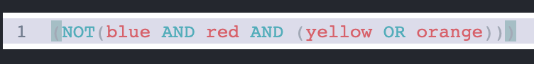

[](https://badge.fury.io/js/lang-simpleboolean)

# `lang-simpleboolean` CodeMirror 6 Language Package

`lang-simpleboolean` is a language package for CodeMirror 6. It is a simple boolean-based query language that allows for statements such as `blue AND red` to be parsed to various components via [`@lezer/lr`](https://www.npmjs.com/package/@lezer/lr). 



The package comes with code highlighting (Operators are shaded cyan, while Identifiers are magenta, and so on) as per CodeMirror, to enable use a CodeMirror theme such as [theme-simple-white](https://www.npmjs.com/package/theme-simple-white).

## Language Grammar

In order of precedence in the parse tree generated from [`@lezer/lr`](https://www.npmjs.com/package/@lezer/lr).

0. `expression` - any combination of the below grammar
1. `AND` - operator token for the `AND` operation
2. `OR` - operator token for the `OR` operation
3. `NOT` - operator token for the `NOT` operation
4. `(` and `)` - parenthesis for use in `Application`
5. `String` - any `Identifers` in double quotes (`"`)
6. `Boolean` - `#t` or `#f` are demarcated as true or false
7. `Space` - a `" "` character is identified in the tree for whitespace-sensitive applications
8. `Tab` - a `\t` character is identified in the tree for whitespace-sensitive applications
9. `CarriageReturn` - a `\n` character is identified in the tree for whitespace-sensitive applications
10. `Application` - an `expression` that is enclosed automatically with `(` and `)`
11. `BooleanExpression` - an `expression` that contains an `Identifier`, an operator token (`AND`/`OR`/`NOT`), and then an `Identifier`, can be nested
12. `Identifier` - any character that is not whitespace nor is already an operator token

## Example Usage

The language package can be used by adding the following lines to your CodeMirror instance:

```
import { simpleBooleanCompletion, simpleBoolean } from 'lang-simpleboolean';
...
const state = EditorState.create({
    ...
    extensions: [
        ...
        simpleBoolean(),
        simpleBooleanCompletion([
          { label: "example1", type: "constant" }, // these are example custom Completion objects
          { label: "example2", type: "constant" }, // they are autocompletion suggestions you can input
          { label: "example3", type: "constant" },
          { label: "example4", type: "keyword" },
        ]),
        onUpdate,
      ],
});
```

Refer to the [CodeMirror 6 Autocomplete Documentation on Completion objects](https://codemirror.net/6/docs/ref/#autocomplete.Completion) for more information on what can be passed into `simpleBooleanCompletion`.

## API Reference

`Language simpleBooleanLanguage`
See [Language class documentation](https://codemirror.net/6/docs/ref/#language.Language).

`function simpleBooleanCompletion(completeFromListParameter: Completion[]=[]) => Extension`
See [Extension class documentation](https://codemirror.net/6/docs/ref/#state.Extension) and [Code Mirror 6 autocomplete documentation](https://codemirror.net/6/docs/ref/#autocomplete).

`function simpleBoolean() => LanguageSupport` 
See [LanguageSupport class documentation](https://codemirror.net/6/docs/ref/#language.LanguageSupport).

## License

[MIT License](https://andreasonny.mit-license.org/2019) © Shreyas Tallamraju